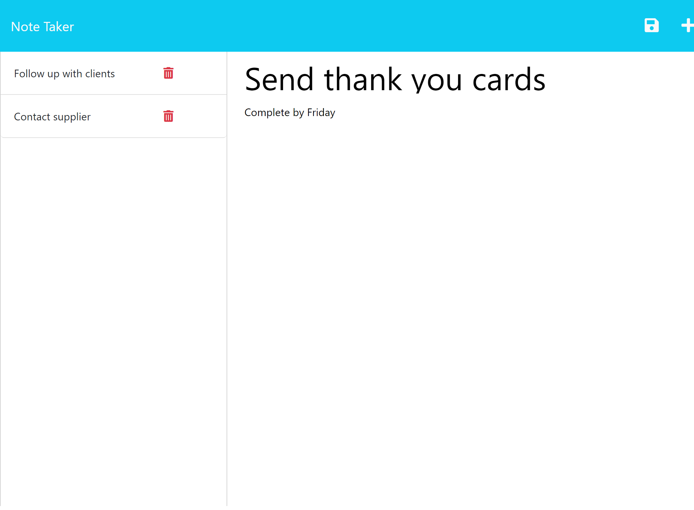

# note-taker-app

## Description

I worked on this note taker app to help small business owners be able to write and save notes. This can help them better organize their thoughts and keep track of tasks they need to complete. While working on this app, I familiarized myself with working with an Express.js server. I was able to better understand API routes and create logic to make the webpage interactive and user friendly. A challenge that I had was handling DELETE requests. Up to that point, I had only learned GET and POST requests. However, pseudo coding what the request needed to handle made me realize that the process was very similar to the POST request which I already understood how to do.

## Installation

N/A

## Usage

The user will first be presented with the homepage of the note taker app. The"Get Started" button will take them to the notes page. The user can click on the right column to write a new note. The note must include both a title and text. Once both of these fields have been filled out, a save icon will appear in the upper right corner. The user can click on the save icon and the note will be added to the left saved notes column. To view a saved note, the user can click on the note and it will appear larger on the right column. To create a new note after viewing a saved note, the user can click on the "+" icon at the upper right corner. To delete a note, the user just needs to click on the "trash" icon. Notes will persist in the way the user selected, even if the page is refreshed.

## Credits

N/A

## License

N/A
